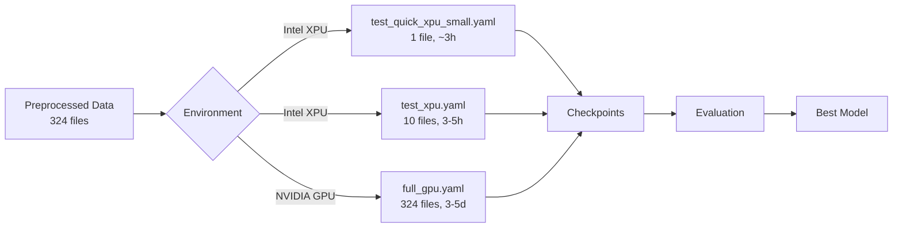

# LogBERT - Log-based BERT Model Training

로그 데이터를 활용한 BERT 기반 anomaly detection 모델 학습 프로젝트입니다.

## 🎯 Project Overview

LogBERT는 시스템 로그 데이터에서 비정상 패턴을 탐지하기 위한 BERT 기반 딥러닝 모델입니다. 이 프로젝트는 Intel XPU(로컬 PC)와 NVIDIA GPU(서버) 환경을 모두 지원합니다.

### ✅ Current Status

- ✅ **Intel XPU 환경 구축 완료**
- ✅ **빠른 검증 (1개 파일) 완료** - 2026-02-01
  - 학습 시간: 3시간 5분
  - Loss 감소: 4.71 → 0.91 (80.7% 감소)
  - 체크포인트: `checkpoints_quick/best_model.pt`
- ✅ **평가 스크립트 구현 완료**
- 🔄 **Ready for**: 10개 파일 테스트 or 전체 학습 (GPU 서버)

---

## 🚀 Quick Start

### Prerequisites
- **Intel XPU**: Intel Arc Graphics, Windows 10/11
- **NVIDIA GPU**: RTX 3090/4090+ recommended
- Python 3.10, Conda

### Installation

#### For Intel XPU (로컬 PC)
```bash
conda create -n logbert_ipex python=3.10 -y
conda activate logbert_ipex
pip install -r requirements_intel_xpu.txt
```

#### For NVIDIA GPU (서버)
```bash
conda create -n logbert_cuda python=3.10 -y
conda activate logbert_cuda
pip install -r requirements_cuda.txt
```

### Training

#### 1️⃣ Quick Test (1 file) - Intel XPU
```powershell
# PowerShell
.\run_quick_test.ps1
```

Or:
```bash
python scripts/train_intel.py --config configs/test_quick_xpu_small.yaml
```
- **Time**: ~3 hours
- **Output**: `checkpoints_quick/`

#### 2️⃣ Standard Test (10 files) - Intel XPU
```bash
python scripts/train_intel.py --config configs/test_xpu.yaml
```
- **Time**: 3-5 hours
- **Output**: `checkpoints_test_xpu/`

#### 3️⃣ Full Training (324 files) - NVIDIA GPU
```bash
python scripts/train_cuda.py --config configs/full_gpu.yaml
```
- **Time**: 3-5 days
- **Output**: `checkpoints_full/`

### Evaluation
```bash
python scripts/evaluate.py --checkpoint checkpoints_quick/best_model.pt --config configs/test_quick_xpu_small.yaml
```

---

## 📊 Training Results

### Quick Test (1 file) - Intel Arc Graphics
- **Date**: 2026-02-01
- **Duration**: 3h 5m
- **Configuration**: `test_quick_xpu_small.yaml`
- **Results**:
  - Initial Loss: 4.71
  - Final Loss: 0.91
  - **Reduction**: 80.7% ✅
  - Total Steps: 5,156
  - Checkpoint: `checkpoints_quick/best_model.pt` (~1.1GB)

**Training Log**: `logs/train_quick_20260201_v2.log`

---

## 📁 Directory Structure

```
logbert/
├── configs/                      # Training configurations
│   ├── test_quick_xpu_small.yaml  # 1 file, Intel XPU (~3h)
│   ├── test_xpu.yaml              # 10 files, Intel XPU (3-5h)
│   ├── test_quick_xpu.yaml        # Alternative quick config
│   ├── full.yaml                  # Full training, CPU/XPU
│   └── full_gpu.yaml              # 324 files, NVIDIA GPU (3-5 days)
├── scripts/                      # Training & evaluation scripts
│   ├── train_intel.py             # Intel XPU training
│   ├── train_cuda.py              # NVIDIA GPU training
│   └── evaluate.py                # Model evaluation
├── docs/                         # Documentation
│   ├── setup_guide.md             # Comprehensive setup guide
│   ├── quick_start.md             # Quick start guide
│   └── evaluation_guide.md        # Evaluation documentation
├── checkpoints/                  # Full training checkpoints
├── checkpoints_quick/            # Quick test checkpoints
│   ├── best_model.pt              # Best performing model
│   ├── epoch_1.pt                 # Epoch checkpoint
│   └── checkpoint_step_*.pt       # Intermediate checkpoints
├── logs/                         # Training and evaluation logs
├── requirements_intel_xpu.txt    # Intel XPU dependencies
├── requirements_cuda.txt         # NVIDIA CUDA dependencies
└── run_quick_test.ps1            # Quick test launcher (Windows)
```

---

## 🛠️ Configuration Guide

각 설정 파일은 다음 환경에 최적화되어 있습니다:

| Config File | Files | Environment | Batch Size | Time | Purpose |
|------------|-------|-------------|------------|------|---------|
| `test_quick_xpu_small.yaml` | 1 | Intel XPU | 16 | ~3h | 코드 검증 ✅ |
| `test_xpu.yaml` | 10 | Intel XPU | 32 | 3-5h | 중간 테스트 |
| `full_gpu.yaml` | 324 | NVIDIA GPU | 64 | 3-5d | 전체 학습 |

### Key Parameters

**Model**:
- `vocab_size`: 10000
- `hidden_size`: 768 (BERT-base)
- `num_hidden_layers`: 12

**Training**:
- `batch_size`: GPU/XPU 메모리에 따라 조정 (8-64)
- `learning_rate`: 2e-5
- `num_epochs`: 1-3
- `num_workers`: 병렬 데이터 로딩 (0-8)

**Data**:
- `limit_files`: 1, 10, or null (전체)
- `max_seq_length`: 512
- `preprocessed_dir`: 전처리된 로그 데이터 경로

---

## 🔧 Troubleshooting

### Intel XPU Issues

**OOM (Out of Memory) Error**:
```yaml
# config 파일에서 조정
training:
  batch_size: 8      # 32 → 16 → 8
  num_workers: 0     # 메모리 절약
```

**XPU Not Available**:
- Intel GPU 드라이버 재설치
- PyTorch XPU 버전 확인: `torch.xpu.is_available()`

### NVIDIA GPU Issues

**CUDA Out of Memory**:
- `batch_size` 감소
- Gradient accumulation 사용

---

## 📚 Documentation

- **[Setup Guide](docs/setup_guide.md)**: 환경 설정 상세 가이드
- **[Quick Start](docs/quick_start.md)**: 빠른 시작 가이드
- **[Evaluation Guide](docs/evaluation_guide.md)**: 모델 평가 가이드

---

## 🎓 Training Pipeline



---

## 🔍 Next Steps

1. **Quick Test 완료** ✅
2. **Option A**: 10개 파일 테스트 (Intel XPU, 3-5시간)
   ```bash
   python scripts/train_intel.py --config configs/test_xpu.yaml
   ```
3. **Option B**: 전체 학습 (GPU 서버 대여, 3-5일)
   ```bash
   python scripts/train_cuda.py --config configs/full_gpu.yaml
   ```

---

## 📝 Notes

- 모든 로그는 UTF-8 인코딩으로 저장됩니다
- 체크포인트는 자동으로 저장됩니다 (best model + epoch checkpoints)
- Intel XPU는 Windows 11 + Intel Arc Graphics에서 테스트되었습니다
- CUDA 환경은 NVIDIA RTX 3090/4090 권장

---

## 📄 License

이 프로젝트는 RADAR 프로젝트의 일부입니다.
