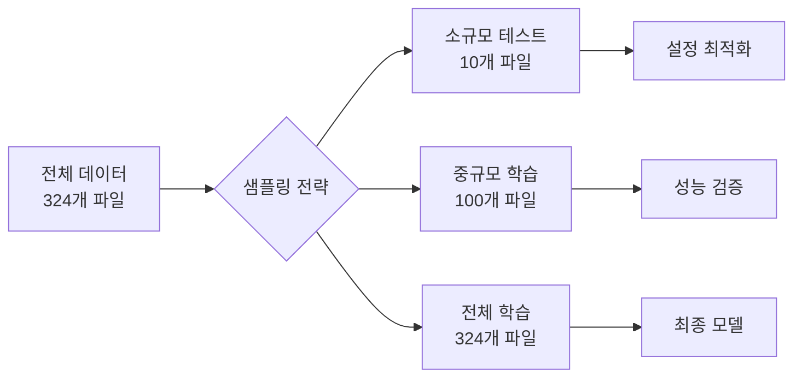
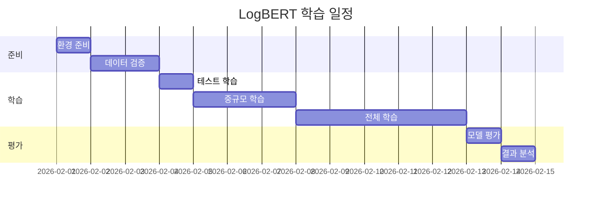

# LogBERT 모델 학습 진행 계획 📚

> 작성일: 2026-02-01  
> 목표: output 폴더의 전처리 완료 데이터로 LogBERT 모델 학습

---

## 📊 현재 상황 분석

### 1. 전처리 완료 데이터

**위치**: `c:\workspace\RADAR\output\`

**데이터 현황**:
- **총 파일 수**: 324개
- **기간**: 2025-02-24 ~ 2026-01-15 (약 11개월)
- **총 데이터 크기**: 약 **137 GB**
- **파일 포맷**: JSON (날짜별)

**데이터 구조**:
```json
{
  "session_id": 0,
  "event_sequence": [1, 5, 1, 12, 3],
  "token_ids": [101, 1, 2, 3, 102, 0, 0],
  "attention_mask": [1, 1, 1, 1, 1, 0, 0],
  "has_error": false,
  "has_warn": true,
  "service_name": "gateway",
  "original_logs": ["..."]
}
```

**일별 데이터 크기 분석**:

| 기간 | 평균 크기 | 특징 |
|------|-----------|------|
| 2025-02 (24-28) | 409 MB | 초기 데이터 |
| 2025-03 | 344 MB | 안정적 |
| 2025-04 | 426 MB | 증가 |
| 2025-05 | 599 MB | 큰 증가 |
| 2025-06 | 650 MB | 최대 |
| 2025-07 ~ 2026-01 | 430 MB | 일정 유지 |

**특이점**:
- 최대 파일 크기: **1.59 GB** (2025-07-03)
- 최소 파일 크기: **9 MB** (2025-11-15)
- 주말/공휴일: 데이터 크기 작음

---

## 🎯 학습 목표

### 1. 주요 목표
- **정상 로그 패턴 학습**: MLM 방식으로 정상적인 로그 시퀀스 학습
- **이상 탐지 모델 구축**: 학습된 패턴과 다른 로그를 이상으로 탐지
- **서비스별 특성 반영**: Gateway, Research, Manager 등 서비스별 패턴 학습

### 2. 성능 지표
- **MLM Loss**: < 0.5 (목표)
- **학습 안정성**: Loss 그래프 수렴
- **이상 탐지 정확도**: 검증 데이터로 평가

---

## 📋 학습 단계별 계획

### Phase 1: 환경 준비 (1일)

#### 1.1 실행 환경 확인

```bash
# CUDA 사용 가능 확인
python -c "import torch; print(f'CUDA Available: {torch.cuda.is_available()}')"
python -c "import torch; print(f'GPU Count: {torch.cuda.device_count()}')"
python -c "import torch; print(f'GPU Name: {torch.cuda.get_device_name(0)}')"
```

#### 1.2 메모리 추정

**데이터 크기**: 137 GB (전체)  
**배치 크기**: 32  
**예상 GPU 메모리**: 약 8-12 GB (모델 + 배치 데이터)

**권장 사양**:
- GPU: NVIDIA V100/A100 (16GB+ VRAM)
- RAM: 32GB 이상
- Storage: SSD 권장 (빠른 I/O)

#### 1.3 의존성 확인

```bash
cd logbert_training
pip install -r requirements.txt --upgrade
```

**주요 패키지**:
- `torch >= 1.10.0`
- `transformers >= 4.0.0`
- `PyYAML`
- `numpy`
- `tqdm`

---

### Phase 2: 데이터 준비 및 검증 (1-2일)

#### 2.1 데이터 샘플링 전략

**전체 데이터 (137GB)를 한 번에 학습하는 것은 비효율적이므로, 단계적 접근:**



**권장 학습 단계**:

1. **테스트 학습** (2-3시간):
   - 파일: 10개 (최근 10일)
   - 목적: 설정 검증, 메모리 확인
   - 데이터: 약 4-5 GB

2. **중규모 학습** (1-2일):
   - 파일: 100개 (최근 3개월)
   - 목적: 모델 성능 검증
   - 데이터: 약 40-50 GB

3. **전체 학습** (3-5일):
   - 파일: 324개 (전체)
   - 목적: 최종 모델 생성
   - 데이터: 137 GB

#### 2.2 데이터 검증 스크립트

```python
# data_validator.py
import json
import os
from pathlib import Path
from collections import Counter

def validate_data():
    """전처리 데이터 검증"""
    output_dir = Path("../output")
    files = sorted(output_dir.glob("preprocessed_logs_*.json"))
    
    print(f"총 파일 수: {len(files)}")
    
    # 샘플 파일 검증
    sample_file = files[0]
    print(f"\n샘플 파일: {sample_file.name}")
    
    with open(sample_file, 'r', encoding='utf-8') as f:
        data = json.load(f)
    
    print(f"세션 수: {len(data)}")
    
    # 첫 세션 구조 확인
    if data:
        session = data[0]
        print("\n첫 세션 구조:")
        for key in session.keys():
            print(f"  - {key}: {type(session[key]).__name__}")
        
        # 시퀀스 길이 분포
        seq_lengths = [len(s.get('event_sequence', [])) for s in data]
        print(f"\n시퀀스 길이:")
        print(f"  - 평균: {sum(seq_lengths)/len(seq_lengths):.1f}")
        print(f"  - 최소: {min(seq_lengths)}")
        print(f"  - 최대: {max(seq_lengths)}")
        
        # 서비스 분포
        services = [s.get('service_name', 'unknown') for s in data]
        service_counts = Counter(services)
        print(f"\n서비스 분포:")
        for service, count in service_counts.most_common():
            print(f"  - {service}: {count}")

if __name__ == '__main__':
    validate_data()
```

**실행**:
```bash
cd logbert_training
python data_validator.py
```

#### 2.3 학습/검증 데이터 분리

```python
# split_data.py
import json
import random
from pathlib import Path

def split_train_val(train_ratio=0.9):
    """학습/검증 데이터 분리"""
    output_dir = Path("../output")
    files = sorted(output_dir.glob("preprocessed_logs_*.json"))
    
    # 파일 셔플 및 분리
    random.shuffle(files)
    split_idx = int(len(files) * train_ratio)
    
    train_files = files[:split_idx]
    val_files = files[split_idx:]
    
    print(f"학습 파일: {len(train_files)}")
    print(f"검증 파일: {len(val_files)}")
    
    # 파일 목록 저장
    with open('train_files.txt', 'w') as f:
        for file in train_files:
            f.write(f"{file}\n")
    
    with open('val_files.txt', 'w') as f:
        for file in val_files:
            f.write(f"{file}\n")

if __name__ == '__main__':
    split_train_val()
```

---

### Phase 3: 테스트 학습 (1일)

#### 3.1 설정 파일 수정

**파일**: `training_config_test.yaml`

```yaml
# LogBERT 테스트 학습 설정

# 모델 설정
model:
  vocab_size: 10000          # Event ID + Special Tokens
  hidden_size: 768           # BERT-base 크기
  num_hidden_layers: 12
  num_attention_heads: 12
  intermediate_size: 3072
  max_position_embeddings: 512
  hidden_dropout_prob: 0.1
  attention_probs_dropout_prob: 0.1

# 학습 설정
training:
  batch_size: 32             # GPU 메모리에 따라 조정
  learning_rate: 0.00002     # 2e-5
  weight_decay: 0.01
  num_epochs: 3              # 테스트: 3 에폭
  total_steps: 10000
  min_lr: 0.000001           # 1e-6
  max_grad_norm: 1.0
  mask_prob: 0.15            # MLM 마스킹 비율
  log_interval: 50           # 자주 로그 출력
  save_interval: 500         # 자주 저장
  num_workers: 4

# 데이터 설정
data:
  preprocessed_dir: "../output"
  max_seq_length: 512
  # 테스트용: 최근 10개 파일만 사용
  limit_files: 10

# 출력 설정
output_dir: "checkpoints_test"
```

#### 3.2 테스트 학습 실행

```bash
cd logbert_training

# 테스트 학습 시작
python train.py --config training_config_test.yaml
```

#### 3.3 예상 결과

**학습 시간**: 2-3시간 (10개 파일, 3 에폭)  
**체크포인트**:
- `checkpoints_test/checkpoint_step_500.pt`
- `checkpoints_test/checkpoint_step_1000.pt`
- `checkpoints_test/best_model.pt`
- `checkpoints_test/epoch_3.pt`

**모니터링 항목**:
```
Epoch 1/3, Step 50/3333
  Loss: 4.2345
  Avg Loss: 4.3210
  LR: 0.00002
  GPU Memory: 8.5 GB / 16.0 GB
```

#### 3.4 문제 해결

**CUDA Out of Memory 발생 시**:
```yaml
training:
  batch_size: 16  # 절반으로 줄이기
```

**학습이 너무 느릴 시**:
```yaml
training:
  num_workers: 8  # 워커 수 증가
```

---

### Phase 4: 중규모 학습 (2-3일)

#### 4.1 설정 파일

**파일**: `training_config_medium.yaml`

```yaml
# LogBERT 중규모 학습 설정

model:
  vocab_size: 10000
  hidden_size: 768
  num_hidden_layers: 12
  num_attention_heads: 12
  intermediate_size: 3072
  max_position_embeddings: 512
  hidden_dropout_prob: 0.1
  attention_probs_dropout_prob: 0.1

training:
  batch_size: 32           # 최적화된 배치 크기
  learning_rate: 0.00002
  weight_decay: 0.01
  num_epochs: 10           # 중규모: 10 에폭
  total_steps: 100000
  min_lr: 0.000001
  max_grad_norm: 1.0
  mask_prob: 0.15
  log_interval: 100
  save_interval: 1000
  num_workers: 8           # 워커 증가

data:
  preprocessed_dir: "../output"
  max_seq_length: 512
  limit_files: 100         # 최근 100개 파일

output_dir: "checkpoints_medium"
```

#### 4.2 학습 실행

```bash
# 백그라운드로 학습 실행 (권장)
nohup python train.py --config training_config_medium.yaml > train_medium.log 2>&1 &

# 로그 모니터링
tail -f train_medium.log
```

#### 4.3 학습 곡선 분석

```bash
# 학습 곡선 플롯
python plot_training_curve.py \
  --checkpoint-dir checkpoints_medium \
  --output training_curve_medium.png
```

**확인 사항**:
- Loss가 수렴하는가?
- Overfitting 징후는 없는가?
- Learning rate schedule이 적절한가?

---

### Phase 5: 전체 학습 (3-5일)

#### 5.1 최종 설정 파일

**파일**: `training_config_full.yaml`

```yaml
# LogBERT 전체 학습 설정 (최종)

model:
  vocab_size: 10000
  hidden_size: 768
  num_hidden_layers: 12
  num_attention_heads: 12
  intermediate_size: 3072
  max_position_embeddings: 512
  hidden_dropout_prob: 0.1
  attention_probs_dropout_prob: 0.1

training:
  batch_size: 32           # 안정적인 배치 크기
  learning_rate: 0.00002
  weight_decay: 0.01
  num_epochs: 20           # 전체: 20 에폭
  total_steps: 500000      # 증가
  min_lr: 0.000001
  max_grad_norm: 1.0
  mask_prob: 0.15
  log_interval: 100
  save_interval: 5000      # 5000 스텝마다 저장
  num_workers: 8

data:
  preprocessed_dir: "../output"
  max_seq_length: 512
  # limit_files 제거 -> 전체 파일 사용

output_dir: "checkpoints_full"
```

#### 5.2 학습 실행 스크립트

**파일**: `run_full_training.sh`

```bash
#!/bin/bash

# 전체 학습 실행 스크립트

echo "=== LogBERT 전체 학습 시작 ==="
date

# GPU 확인
nvidia-smi

# 학습 시작
python train.py \
  --config training_config_full.yaml \
  > train_full.log 2>&1

echo "=== 학습 완료 ==="
date
```

**실행**:
```bash
chmod +x run_full_training.sh
nohup ./run_full_training.sh &
```

#### 5.3 학습 모니터링

**실시간 모니터링**:
```bash
# 로그 확인
tail -f train_full.log

# GPU 사용률 모니터링
watch -n 1 nvidia-smi

# 디스크 I/O 확인 (Linux)
iostat -x 5
```

**체크포인트 크기 확인**:
```bash
du -h checkpoints_full/
```

---

### Phase 6: 모델 평가 (1일)

#### 6.1 이상 탐지 추론

```bash
# 최고 성능 모델로 추론
python detect_anomalies.py \
  --checkpoint checkpoints_full/best_model.pt \
  --input ../output/preprocessed_logs_2026-01-15.json \
  --output anomaly_results.json \
  --threshold 2.0
```

#### 6.2 결과 분석

**파일**: `analyze_results.py`

```python
import json
from collections import Counter

def analyze_anomaly_results(results_file):
    """이상 탐지 결과 분석"""
    with open(results_file, 'r') as f:
        results = json.load(f)
    
    # 이상 점수 분포
    scores = [r['anomaly_score'] for r in results]
    print(f"이상 점수 통계:")
    print(f"  - 평균: {sum(scores)/len(scores):.2f}")
    print(f"  - 최소: {min(scores):.2f}")
    print(f"  - 최대: {max(scores):.2f}")
    
    # 이상 탐지 비율
    anomalies = [r for r in results if r['is_anomaly']]
    print(f"\n이상 탐지:")
    print(f"  - 전체 세션: {len(results)}")
    print(f"  - 이상 세션: {len(anomalies)}")
    print(f"  - 이상 비율: {len(anomalies)/len(results)*100:.1f}%")
    
    # 서비스별 분포
    service_anomalies = Counter(r['service_name'] for r in anomalies)
    print(f"\n서비스별 이상 탐지:")
    for service, count in service_anomalies.most_common():
        print(f"  - {service}: {count}")

if __name__ == '__main__':
    analyze_anomaly_results('anomaly_results.json')
```

#### 6.3 성능 지표

**평가 지표**:
- **Precision**: 정밀도
- **Recall**: 재현율
- **F1-Score**: 조화 평균
- **AUC-ROC**: ROC 곡선 아래 면적

**시각화**:
```bash
# ROC 곡선 플롯
python plot_roc_curve.py \
  --results anomaly_results.json \
  --output roc_curve.png
```

---

## 📊 예상 일정 및 리소스

### 일정 (총 9-14일)



### 컴퓨팅 리소스

| 단계 | GPU 사용 | 시간 | 데이터 크기 |
|------|----------|------|-------------|
| 테스트 학습 | 1x GPU (8-12 GB VRAM) | 2-3시간 | 4-5 GB |
| 중규모 학습 | 1x GPU (12-16 GB VRAM) | 1-2일 | 40-50 GB |
| 전체 학습 | 1x GPU (16-32 GB VRAM) | 3-5일 | 137 GB |

**권장 GPU**:
- NVIDIA V100 (16GB)
- NVIDIA A100 (40GB) - 최적
- RTX 3090 (24GB)
- RTX 4090 (24GB)

---

## 🔧 주요 파일 및 스크립트

### 생성 필요 파일

```
logbert_training/
├── training_config_test.yaml      # 테스트 학습 설정
├── training_config_medium.yaml    # 중규모 학습 설정
├── training_config_full.yaml      # 전체 학습 설정
├── data_validator.py              # 데이터 검증
├── split_data.py                  # 학습/검증 분리
├── run_full_training.sh           # 전체 학습 실행 스크립트
└── analyze_results.py             # 결과 분석
```

### 기존 파일 활용

```
logbert_training/
├── train.py                       # ✅ 이미 존재
├── model.py                       # ✅ 이미 존재
├── dataset.py                     # ✅ 이미 존재
├── detect_anomalies.py            # ✅ 이미 존재
├── plot_training_curve.py         # ✅ 이미 존재
└── requirements.txt               # ✅ 이미 존재
```

---

## 📝 체크리스트

### Phase 1: 환경 준비 ✅
- [ ] CUDA 사용 가능 확인
- [ ] GPU 메모리 확인
- [ ] 의존성 설치
- [ ] 디스크 공간 확인 (최소 200GB)

### Phase 2: 데이터 준비 ✅
- [ ] 데이터 검증 스크립트 실행
- [ ] 학습/검증 데이터 분리
- [ ] 샘플 데이터 확인

### Phase 3: 테스트 학습 ✅
- [ ] 테스트 설정 파일 작성
- [ ] 테스트 학습 실행
- [ ] 체크포인트 생성 확인
- [ ] Loss 수렴 확인

### Phase 4: 중규모 학습 ✅
- [ ] 중규모 설정 파일 작성
- [ ] 중규모 학습 실행
- [ ] 학습 곡선 분석
- [ ] 성능 검증

### Phase 5: 전체 학습 ✅
- [ ] 최종 설정 파일 작성
- [ ] 전체 학습 실행
- [ ] 정기 체크포인트 확인
- [ ] 최종 모델 평가

### Phase 6: 모델 평가 ✅
- [ ] 이상 탐지 추론 실행
- [ ] 결과 분석
- [ ] 성능 지표 계산
- [ ] 시각화

---

## ⚠️ 주의사항

### 1. 메모리 관리

**문제**: `CUDA Out of Memory`  
**해결**:
```yaml
training:
  batch_size: 16  # 배치 크기 감소
  num_workers: 4  # 워커 수 감소
```

### 2. 디스크 공간

**문제**: 디스크 공간 부족  
**해결**:
- 체크포인트 정기 삭제
- `save_interval` 증가
- 불필요한 중간 체크포인트 제거

### 3. 학습 속도

**문제**: 학습이 너무 느림  
**해결**:
```yaml
training:
  batch_size: 64    # 배치 크기 증가 (GPU 메모리 허용 시)
  num_workers: 12   # 워커 수 증가
```

### 4. Loss가 수렴하지 않음

**문제**: Loss가 계속 높음  
**해결**:
```yaml
training:
  learning_rate: 0.00001  # 학습률 감소
  num_epochs: 30          # 에폭 수 증가
  weight_decay: 0.05      # 정규화 강화
```

### 5. 학습 중단 및 재개

**중단 시 체크포인트 활용**:
```bash
# 최신 체크포인트에서 재개
python train.py \
  --config training_config_full.yaml \
  --resume checkpoints_full/checkpoint_step_25000.pt
```

---

## 🎯 성공 기준

### 정량적 지표

| 지표 | 목표 값 |
|------|---------|
| **MLM Loss (학습)** | < 0.5 |
| **MLM Loss (검증)** | < 0.6 |
| **이상 탐지 Precision** | > 0.8 |
| **이상 탐지 Recall** | > 0.7 |
| **F1-Score** | > 0.75 |

### 정성적 지표

- ✅ Loss 그래프가 안정적으로 수렴
- ✅ 검증 Loss와 학습 Loss 차이 < 0.2 (Overfitting 방지)
- ✅ 서비스별 이상 탐지가 균형있게 작동
- ✅ 실제 에러 로그를 높은 확률로 탐지

---

## 📚 다음 단계

### LogBERT 학습 완료 후

1. **앙상블 시스템 구축**
   - DeepLog, LogLSTM, LogTCN 모델 학습
   - 4개 모델 통합

2. **치명도 계산 모듈**
   - 이상 점수 → 치명도 변환
   - 서비스 가중치 적용

3. **소스 코드 RAG**
   - 코드 파싱 및 벡터화
   - 로그-코드 연결

4. **API 서버 구축**
   - FastAPI 구현
   - 엔드포인트 개발

---

## 💡 팁 및 권장사항

### 1. 점진적 접근
- 작은 데이터로 시작 → 점진적 확대
- 설정 최적화 후 전체 학습

### 2. 정기 백업
```bash
# 체크포인트 백업
rsync -av checkpoints_full/ backup/checkpoints_full_$(date +%Y%m%d)/
```

### 3. 실험 추적
- 학습 로그 보관
- 설정 파일 버전 관리
- 성능 지표 기록

### 4. GPU 효율성
- Mixed Precision (FP16) 사용 고려
- Gradient Accumulation 활용
- Gradient Checkpointing (메모리 절약)

### 5. 모니터링 도구
- TensorBoard 활용
- Weights & Biases (wandb) 고려
- 실시간 알림 설정

---

## 📞 문의 및 지원

**문제 발생 시**:
1. 로그 파일 확인 (`train_*.log`)
2. GPU 메모리 확인 (`nvidia-smi`)
3. 설정 파일 검증
4. 체크포인트 복구

**추가 문서**:
- [LogBERT README](file:///c:/workspace/RADAR/logbert_training/README.md)
- [QUICK_START](file:///c:/workspace/RADAR/logbert_training/QUICK_START.md)
- [TRAINING_DETAILS](file:///c:/workspace/RADAR/logbert_training/TRAINING_DETAILS.md)

---

**작성일**: 2026-02-01  
**예상 완료일**: 2026-02-14  
**프로젝트**: RADAR - MSA 로그 이상 탐지 시스템
